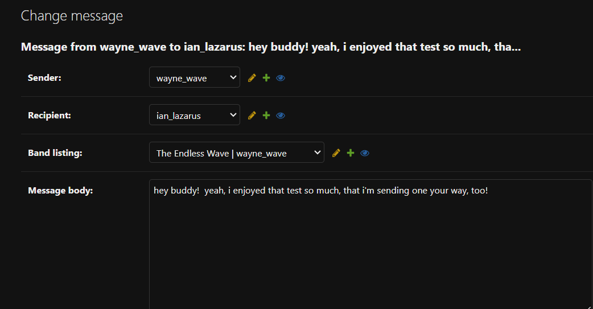
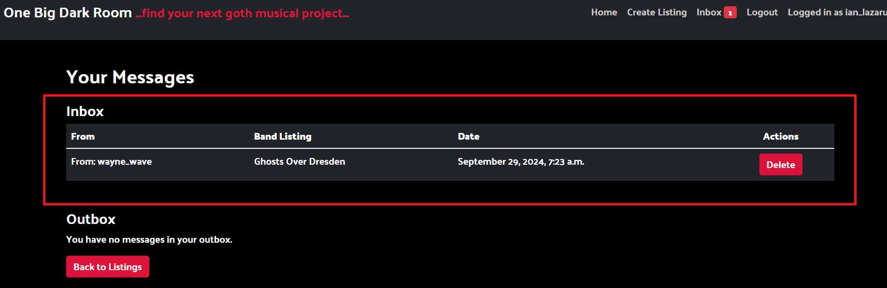
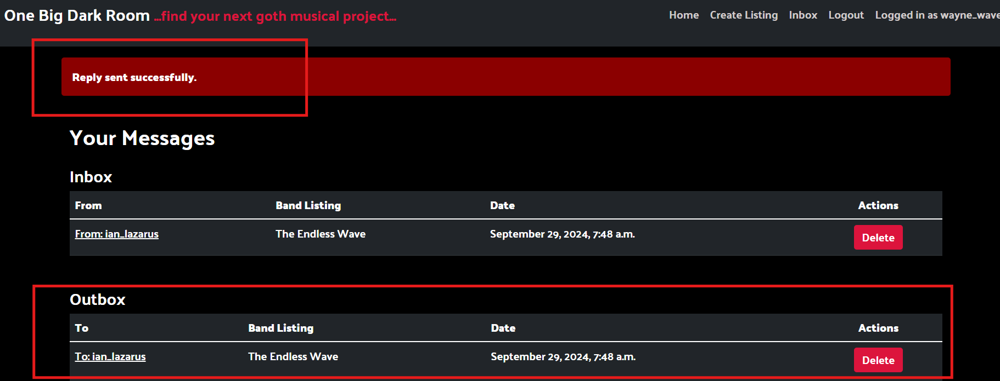
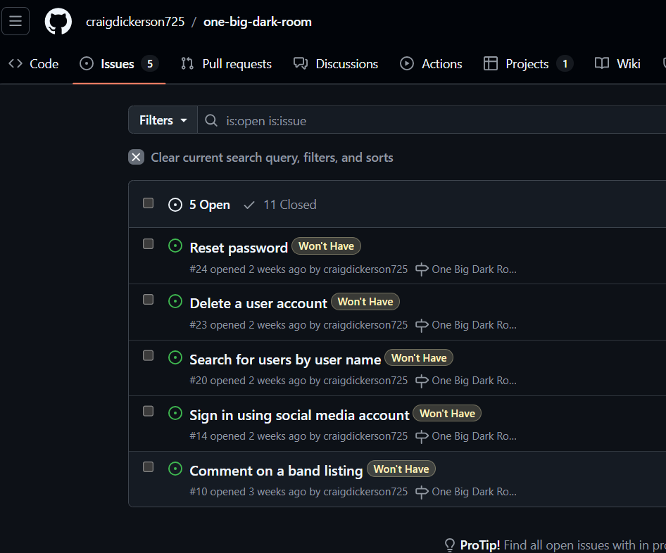

# [ONE BIG DARK ROOM](https://one-big-dark-room-87cda9aa36e7.herokuapp.com)

[](https://github.com/craigdickerson725/one-big-dark-room/commits/main)
[](https://github.com/craigdickerson725/one-big-dark-room/commits/main)
[](https://github.com/craigdickerson725/one-big-dark-room)

Welcome to One Big Dark Room!  This website is designed to help musicians in the goth community connect with band projects near them.  Users who are musicians looking for bands within the 'goth' sub-genres (ie, Darkwave, Post-Punk, Synthwave, Goth Rock, etc) can search the Band Listings (on the Home page) for bands near their location who have open spots.  Likewise, users who have band projects, but not enough musicians to complete their line-up, can create a band listing describing their sound and what instruments they'd like to have added to their band.  My hope is to make it easier for musicians in the goth community to connect with others who can help them fulfill their musical visions, as well as to create a presence in their local music scene.  In the future, I hope to grow the site to add the ability for bands to post their music as well, and to include a section to help bands with booking gigs.


source: [amiresponsive](https://ui.dev/amiresponsive?url=https://one-big-dark-room-87cda9aa36e7.herokuapp.com)

## UX

The goal of One Big Dark Room is to provide an intuitive platform where users can easily list and discover band projects. The design and functionality of the application prioritize ease of use, simplicity, and clarity, creating a smooth experience for both band creators and potential collaborators.

### Key Features:

#### Homepage:

- Upon visiting the homepage, users are greeted with a clean layout showcasing the latest band listings.
- A prominent heading, "Band Listings", is accompanied by smaller text reading "...find your next band project, or list your own...", offering guidance to new visitors on the platform's purpose.
- If a band listing lacks a custom photo, a default placeholder image is displayed, ensuring consistency in the presentation of listings.

#### Band Listing Creation:

- Users can easily create new band listings through a form powered by crispy forms. The form is straightforward, requiring only essential details such as the band name, description, and a photo (optional).
- To streamline the process, each band listing automatically has its status set to 'Published' upon creation, without the need for manual intervention.

#### Band Listing Detail Page:

- Clicking on a band listing from the homepage leads to a detailed view. Users can view more information about the band, including a photo, and full description. The design ensures that even if no photo is provided, a default image is shown for a seamless viewing experience.

#### Inbox and Messaging:

- The application includes an inbox for handling communication between users. If a user has unread messages, a red alert icon is visible in the navbar, ensuring that important messages aren't missed.
- The inbox system is integrated into the homepage for quick access.

#### User Feedback:

- The UI incorporates Bootstrap to ensure responsive design, making the platform accessible across devices.
- Notifications, modals (such as the deletion confirmation in the band listing detail), and alerts are designed to be minimal yet effective, reducing any friction in user interaction.

#### Future Enhancements:

- The project aims to continuously improve user experience by considering feedback and adding features such as:

  * Advanced search functionality for filtering band listings by genre, location, or other criteria.
  * Enhanced profile pages for band creators to showcase their previous projects.
  * Notification systems to alert users of new listings matching their preferences.

### Colour Scheme

The One Big Dark Room project utilizes a carefully chosen color scheme to enhance readability, user engagement, and ease of navigation. The color palette is simple yet effective, creating a clean and modern aesthetic.

#### Primary Background Color:

- The overall background is a dark shade that provides a sleek, modern look, evoking a professional and focused atmosphere. This dark theme helps other elements stand out while reducing eye strain during prolonged use.

#### Text Colors:

- The default text color is white, ensuring high contrast against the dark background for easy readability.

#### Hover Effects: 

- Interactive elements, such as buttons and message alerts, utilize hover effects with color shifts to signal interactivity.

#### Buttons and Alerts:

- Important actions like creating a listing or confirming actions (such as deletion) are styled with buttons that use clear, distinguishable colors, typically leaning towards neutral or dark themes to maintain consistency with the overall design. The modal confirmation buttons (like the 'Yes' button) are styled without extra borders to create a clean appearance.

#### Visual Alerts:

- New messages in the inbox are marked with a red alert icon, ensuring that users can quickly identify pending actions or notifications.

This color scheme balances functionality with aesthetics, ensuring a visually pleasing experience without overwhelming the user with bright or excessive color variations.

### Typography

One Big Dark Room uses a clean and modern Palanquin Dark font throughout the application. The typography is designed to be minimal and readable, complementing the dark-themed background. Headings and important elements are slightly larger to establish hierarchy, while body text remains simple and easy to scan, ensuring a user-friendly reading experience across all devices.

- [Palanquin Dark](https://fonts.google.com/specimen/Palanquin Dark) was used for the primary headers and titles.

## User Stories

### Site Users

- As a Site User I can see a paginated view of all published band listings so that I can quickly search for ones that appeal to me.
- As a Site User I can open an individual band listing so that I can read the full text of the listing.
- As a Site User I can create a user account so that I can use the full features of the site.
- As a Site User I can create a band listing so that I can connect with the community of other musicians on the site.
- As a Site User I can edit or delete my band listing so that my listing is always accurate/up-to-date, or removed from the site.
- As a Site User I can message an artist via their band listing so that I can propose a collaboration.
- As a Site User I can receive messages from other users so that I can communicate with them about possible collaborations.
- As a Site User I can reply to messages so that I can respond to and interact with other users.

### Site Admin

- As a Site Administrator I can create, read, update, and delete band listings so that I can manage the content of my site.
- As a Site Administrator I can create draft band listings so that I can complete the band listing at a later time.

## Wireframes

To follow best practice, wireframes were developed for mobile, and desktop sizes.
I've used [Balsamiq](https://balsamiq.com/wireframes) to design my site wireframes.

<details>
<summary> Click here to see the Wireframes </summary>

Home
  - 

Login
  - 

Logout
  - 

Sign Up
  - 

Create Listing
  - 

Inbox
  - 

</details>

## Features

### Existing Features

- **Paginated Band Listings**

    - Users can view a paginated list of all published band listings, allowing them to easily browse through available opportunities and quickly find listings that interest them.


- **Individual Band Listing View**

    - Each band listing can be opened to display the full content, providing detailed information for users to consider before deciding to reach out.


- **User Account, Band Listing, and Message Management**

    - Site administrators have full control over user accounts, band listings, and messages including the ability to create, read, update, and delete listings, ensuring that the content remains relevant and up-to-date.  This also helps administrators to remove undesired content.




- **Draft Band Listings**

    - Administrators can create draft versions of band listings and complete them at a later time, giving flexibility in managing content creation.


- **User Account Registration**

    - Users can register for an account, which allows them to log in, create band listings, and message other users.


- **Create a Band Listing**

    - Logged-in users can create their own band listings, which will be displayed on the site once approved, enabling musicians to connect and collaborate.


- **Edit or Delete Band Listings**

    - Users can edit or delete their own band listings to keep information current or remove outdated entries.


- **Message Artists through Band Listings**

    - Users can send messages to artists directly through their band listings to propose collaborations or inquire about opportunities.


- **Receive and Manage Messages**

    - Users are notified when they receive a message and can read messages in their inbox.





- **Reply to Messages**

    - Users can respond to incoming messages to continue conversations, facilitating back-and-forth communication.




- **Delete Messages from Inbox**

    - Users can delete messages from both their inbox and outbox, allowing them to manage and organize their conversations as needed.


### Future Features

- Comment on Band Listings
    - Users will be able to comment on band listings, allowing them to engage in conversations directly within the listing. This feature will support threaded discussions to enhance user interaction.
- Social Media Login Integration
    - Users will have the option to sign in using their existing social media accounts (e.g., Facebook, Instagram), streamlining the registration process and reducing the need to create a separate account for the site.
- Username Search
    - A search function will allow users to find other members by their username. This feature will help users locate specific profiles or band listings more easily, fostering connections within the community.

- Password Reset Functionality
    - A password recovery option will be implemented, enabling users to reset their password via email in case they forget it. This ensures users can regain access to their accounts seamlessly.

- Account Deletion
    - Users will be able to delete their accounts, removing all associated data, including their band listings and personal information, from the site.

## Tools & Technologies Used

- [](https://tim.2bn.dev/markdown-builder) used to generate README and TESTING templates.
- [](https://git-scm.com) used for version control. (`git add`, `git commit`, `git push`)
- [](https://github.com) used for secure online code storage.
- [](https://gitpod.io) used as a cloud-based IDE for development.
- [](https://en.wikipedia.org/wiki/HTML) used for the main site content.
- [](https://en.wikipedia.org/wiki/CSS) used for the main site design and layout.
- [](https://www.javascript.com) used for user interaction on the site.
- [](https://www.python.org) used as the back-end programming language.
- [](https://pages.github.com) used for hosting the deployed front-end site.
- [](https://www.heroku.com) used for hosting the deployed back-end site.
- [](https://getbootstrap.com) used as the front-end CSS framework for modern responsiveness and pre-built components.
- [](https://www.djangoproject.com) used as the Python framework for the site.
- [](https://dbs.ci-dbs.net) used as the Postgres database from Code Institute.
- [](https://cloudinary.com) used for online static file storage.
- [](https://whitenoise.readthedocs.io) used for serving static files with Heroku.
- [](https://balsamiq.com/wireframes) used for creating wireframes.
- [](https://fontawesome.com) used for the icons.
- [](https://chat.openai.com) used to help debug, troubleshoot, and explain things.

## Database Design

Entity Relationship Diagrams (ERD) help to visualize database architecture before creating models.
Understanding the relationships between different tables can save time later in the project.

I have used `pygraphviz` and `django-extensions` to auto-generate an ERD.

The steps taken were as follows:
- In the terminal: `sudo apt update`
- then: `sudo apt-get install python3-dev graphviz libgraphviz-dev pkg-config`
- then type `Y` to proceed
- then: `pip3 install django-extensions pygraphviz`
- in my `settings.py` file, I added the following to my `INSTALLED_APPS`:
```python
INSTALLED_APPS = [
    ...
    'django_extensions',
    ...
]
```
- back in the terminal: `python3 manage.py graph_models -a -o erd.png`
- dragged the new `erd.png` file into my `documentation/` folder
- removed `'django_extensions',` from my `INSTALLED_APPS`
- finally, in the terminal: `pip3 uninstall django-extensions pygraphviz -y`


source: [medium.com](https://medium.com/@yathomasi1/1-using-django-extensions-to-visualize-the-database-diagram-in-django-application-c5fa7e710e16)

I have also used Mermaid to generate an interactive ERD of my models.


Source [Mermaid](https://mermaid.live/edit#pako:eNqNU11vozAQ_CvIz0lEKd9vrZqrql6rqty9nJCQgzfEOrCRbdqmaf77bSCUJES9-gGtZta7s8N6Q3LJgMQE1A2nhaJVKiw8v5P5s7Xp4t3hwlicWU_3A6SN4qKwGg1K0ApGRE21fpWKjQioKC9H6JIrbbKzlUp6xGxT0QXXV483P--SX3ePt9_TuqCCnW-hy6YYT7CSRo5QBjpXvDZcioFj1IDhFVi5AgxZRs0ZsqlZSx7e3KnVhppGD5iBNwQFr2swx5l9-cXa-nF_YsfDPEmubuf_saLtB4KB-qzQwwpyXnPA6JRpjSu5NjsDDslWaQVa0wKyhWTrM1PvPjhhVQ_cQsoSqLC4znAgNiYYlNDNmXViv0z5FH7iSLvFHx_TqdwcLUt84ON4lfYXejvjfj49LjrkoEqTfScRtQJ_wdZ9MpmQChS-CYbPsP13KTErwCUlMYaMqr8pScUW82hjZLIWOYmNamBCun3aP1wSL2mpEa2pIPGGvJHYsS9mjud4bmjbdoAnnJA1wsEs9G33wo2i4DKwXc_bTsi7lFjCnkWOHwaeG_l-5IeXTtTW-9OSXVMlm2K1b7b9B2MjSlQ)

## Agile Development Process

### GitHub Projects

[GitHub Projects](https://github.com/craigdickerson725/one-big-dark-room/projects) served as an Agile tool for this project.
It isn't a specialized tool, but with the right tags and project creation/issue assignments, it can be made to work.

Through it, user stories, issues, and milestone tasks were planned, then tracked on a weekly basis using the basic Kanban board.


### GitHub Issues

[GitHub Issues](https://github.com/craigdickerson725/one-big-dark-room/issues) served as an another Agile tool.
There, I used my own **User Story Template** to manage user stories.

It also helped with milestone iterations on a weekly basis.

- [Open Issues](https://github.com/craigdickerson725/one-big-dark-room/issues) [](https://github.com/craigdickerson725/one-big-dark-room/issues)

    

- [Closed Issues](https://github.com/craigdickerson725/one-big-dark-room/issues?q=is%3Aissue+is%3Aclosed) [](https://github.com/craigdickerson725/one-big-dark-room/issues?q=is%3Aissue+is%3Aclosed)

    

### MoSCoW Prioritization

I've decomposed my Epics into stories prior to prioritizing and implementing them.
Using this approach, I was able to apply the MoSCow prioritization and labels to my user stories within the Issues tab.

- **Must Have**: guaranteed to be delivered (*max 60% of stories*)
- **Should Have**: adds significant value, but not vital (*the rest ~20% of stories*)
- **Could Have**: has small impact if left out (*20% of stories*)
- **Won't Have**: not a priority for this iteration

## Testing

> [!NOTE]  
> For all testing, please refer to the [TESTING.md](TESTING.md) file.

## Deployment

The live deployed application can be found deployed on [Heroku](https://one-big-dark-room-87cda9aa36e7.herokuapp.com).

### PostgreSQL Database

This project uses a [Code Institute PostgreSQL Database](https://dbs.ci-dbs.net).

To obtain my own Postgres Database from Code Institute, I followed these steps:

- Signed-in to the CI LMS using my email address.
- An email was sent to me with my new Postgres Database.

> [!CAUTION]  
> - PostgreSQL databases by Code Institute are only available to CI Students.
> - You must acquire your own PostgreSQL database through some other method
> if you plan to clone/fork this repository.
> - Code Institute students are allowed a maximum of 8 databases.
> - Databases are subject to deletion after 18 months.

### Cloudinary API

This project uses the [Cloudinary API](https://cloudinary.com) to store media assets online, due to the fact that Heroku doesn't persist this type of data.

To obtain your own Cloudinary API key, create an account and log in.

- For *Primary interest*, you can choose *Programmable Media for image and video API*.
- Optional: *edit your assigned cloud name to something more memorable*.
- On your Cloudinary Dashboard, you can copy your **API Environment Variable**.
- Be sure to remove the `CLOUDINARY_URL=` as part of the API **value**; this is the **key**.

### Heroku Deployment

This project uses [Heroku](https://www.heroku.com), a platform as a service (PaaS) that enables developers to build, run, and operate applications entirely in the cloud.

Deployment steps are as follows, after account setup:

- Select **New** in the top-right corner of your Heroku Dashboard, and select **Create new app** from the dropdown menu.
- Your app name must be unique, and then choose a region closest to you (EU or USA), and finally, select **Create App**.
- From the new app **Settings**, click **Reveal Config Vars**, and set your environment variables.

> [!IMPORTANT]  
> This is a sample only; you would replace the values with your own if cloning/forking my repository.

| Key | Value |
| --- | --- |
| `CLOUDINARY_URL` | user's own value |
| `DATABASE_URL` | user's own value |
| `DISABLE_COLLECTSTATIC` | 1 (*this is temporary, and can be removed for the final deployment*) |
| `SECRET_KEY` | user's own value |

Heroku needs three additional files in order to deploy properly.

- requirements.txt
- Procfile
- runtime.txt

You can install this project's **requirements** (where applicable) using:

- `pip3 install -r requirements.txt`

If you have your own packages that have been installed, then the requirements file needs updated using:

- `pip3 freeze --local > requirements.txt`

The **Procfile** can be created with the following command:

- `echo web: gunicorn app_name.wsgi > Procfile`
- *replace **app_name** with the name of your primary Django app name; the folder where settings.py is located*

The **runtime.txt** file needs to know which Python version you're using:
1. type: `python3 --version` in the terminal.
2. in the **runtime.txt** file, add your Python version:
	- `python-3.9.19`

For Heroku deployment, follow these steps to connect your own GitHub repository to the newly created app:

Either:

- Select **Automatic Deployment** from the Heroku app.

Or:

- In the Terminal/CLI, connect to Heroku using this command: `heroku login -i`
- Set the remote for Heroku: `heroku git:remote -a app_name` (replace *app_name* with your app name)
- After performing the standard Git `add`, `commit`, and `push` to GitHub, you can now type:
	- `git push heroku main`

The project should now be connected and deployed to Heroku!

### Local Deployment

This project can be cloned or forked in order to make a local copy on your own system.

For either method, you will need to install any applicable packages found within the *requirements.txt* file.

- `pip3 install -r requirements.txt`.

You will need to create a new file called `env.py` at the root-level,
and include the same environment variables listed above from the Heroku deployment steps.

> [!IMPORTANT]  
> This is a sample only; you would replace the values with your own if cloning/forking my repository.

Sample `env.py` file:

```python
import os

os.environ.setdefault("CLOUDINARY_URL", "user's own value")
os.environ.setdefault("DATABASE_URL", "user's own value")
os.environ.setdefault("SECRET_KEY", "user's own value")

# local environment only (do not include these in production/deployment!)
os.environ.setdefault("DEBUG", "True")
```

Once the project is cloned or forked, in order to run it locally, you'll need to follow these steps:

- Start the Django app: `python3 manage.py runserver`
- Stop the app once it's loaded: `CTRL+C` or `⌘+C` (Mac)
- Make any necessary migrations: `python3 manage.py makemigrations`
- Migrate the data to the database: `python3 manage.py migrate`
- Create a superuser: `python3 manage.py createsuperuser`
- Load fixtures (if applicable): `python3 manage.py loaddata file-name.json` (repeat for each file)
- Everything should be ready now, so run the Django app again: `python3 manage.py runserver`

#### Cloning

You can clone the repository by following these steps:

1. Go to the [GitHub repository](https://github.com/craigdickerson725/one-big-dark-room) 
2. Locate the Code button above the list of files and click it 
3. Select if you prefer to clone using HTTPS, SSH, or GitHub CLI and click the copy button to copy the URL to your clipboard
4. Open Git Bash or Terminal
5. Change the current working directory to the one where you want the cloned directory
6. In your IDE Terminal, type the following command to clone my repository:
	- `git clone https://github.com/craigdickerson725/one-big-dark-room.git`
7. Press Enter to create your local clone.

Alternatively, if using Gitpod, you can click below to create your own workspace using this repository.

[](https://gitpod.io/#https://github.com/craigdickerson725/one-big-dark-room)

Please note that in order to directly open the project in Gitpod, you need to have the browser extension installed.
A tutorial on how to do that can be found [here](https://www.gitpod.io/docs/configure/user-settings/browser-extension).

#### Forking

By forking the GitHub Repository, we make a copy of the original repository on our GitHub account to view and/or make changes without affecting the original owner's repository.
You can fork this repository by using the following steps:

1. Log in to GitHub and locate the [GitHub Repository](https://github.com/craigdickerson725/one-big-dark-room)
2. At the top of the Repository (not top of page) just above the "Settings" Button on the menu, locate the "Fork" Button.
3. Once clicked, you should now have a copy of the original repository in your own GitHub account!

### Local VS Deployment

I have not found any noticeable differences between the deployed version and local version of the One Big Dark Room project.

## Credits

### Content

| Source | Location | Notes |
| --- | --- | --- |
| [Markdown Builder](https://tim.2bn.dev/markdown-builder) | README and TESTING | tool to help generate the Markdown files |
| [Chris Beams](https://chris.beams.io/posts/git-commit) | version control | "How to Write a Git Commit Message" |
| [W3Schools](https://www.w3schools.com/bootstrap5/) | bootstrap 5 tutorial | main layout and design for website |
| [Bootstrap](https://getbootstrap.com/docs/5.1/components/modal/) | components page | modal design |
| [WhiteNoise](http://whitenoise.evans.io) | entire site | hosting static files on Heroku temporarily |

In addition to the resources listed above, I have to give a special mention to my mentor, Tim Nelson, who helped me to correct an issue with deleting messages.  The issue itself will be explained more in the TESTING.md file.  But specifically, the following code snippet that helped correct things is as follows:

Function for allowing a sender to delete a message

``` python
def delete_by_sender(request, id):
    message = get_object_or_404(Message, id=id)
    if not message.sender == request.user:
        messages.error(request, "You cannot delete this message.")
        return redirect('messages')
    if message.deleted_by_recipient:
        message.delete()
        messages.success(request, "Message deleted successfully.")
        return redirect('messages')
    else:
        message.deleted_by_sender = True
        message.save()
        messages.success(request, "Message deleted successfully.")
        return redirect('messages')
```

Function for allowing a recipient to delete a message

``` python
def delete_by_recipient(request, id):
    message = get_object_or_404(Message, id=id)
    if not message.recipient == request.user:
        messages.error(request, "You cannot delete this message.")
        return redirect('messages')
    if message.deleted_by_sender:
        message.delete()
        messages.success(request, "Message deleted successfully.")
        return redirect('messages')
    else:
        message.deleted_by_recipient = True
        message.save()
        messages.success(request, "Message deleted successfully.")
        return redirect('messages')
```

### Media

The photos for the band pages (except the Ghosts Over Dresden band image) are license-free, and taken from Wallpaper Access.  There is not an individual link for every image--instead they all appear on the same page and can be scrolled through.  Clicking on 'download image' simply downloads the image to your default downloads folder.  The Wallpaper Access site will be listed below, and all images can be seen there.  The Ghosts Over Dresden band image was created by Bea Keller and Cindy Wagner, independent graphic artists, who created it specifically for me.

| Source | Location | Type | Notes |
| --- | --- | --- | --- |
| [Wallpaper Access](https://wallpaperaccess.com/cyberpunk-synthwave) | cyperpunk-synthwave page | images | band images for band listings |

### Acknowledgements

- I would like to thank my Code Institute mentor, [Tim Nelson](https://github.com/TravelTimN) for his support throughout the development of this project, I would not have gotten this far not only in this project, but in this course as a whole, without his help.
- I would like to thank the [Code Institute Slack community](https://code-institute-room.slack.com) for the moral support; it kept me going during periods of self doubt and imposter syndrome.
- I would like to thank my wife Julia and my daughter Fini, for believing in me, and allowing me to make this transition into software development.