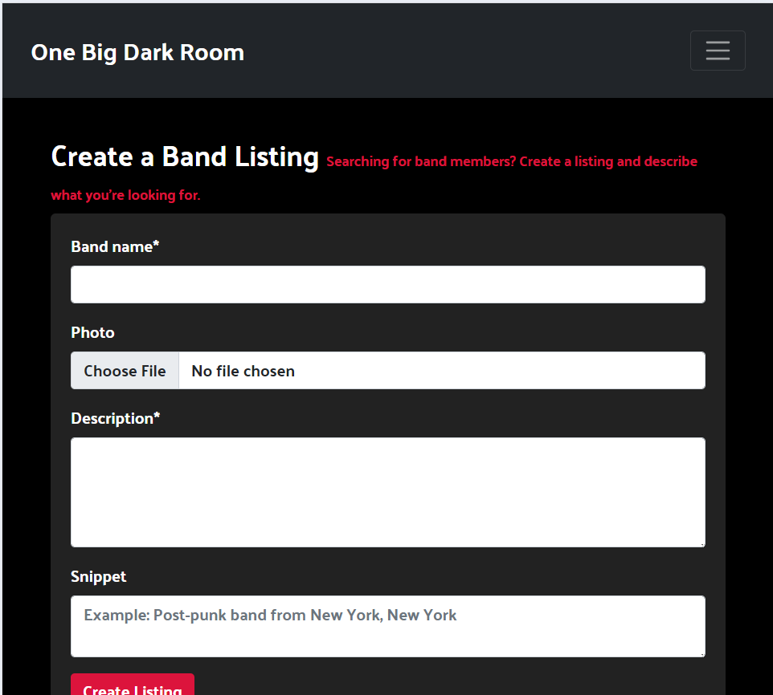

In this section, I aim to demonstrate that comprehensive testing has been conducted throughout the development of One Big Dark Room. The goal is to ensure that the website operates as expected, providing a seamless experience for all users while achieving its intended functionality.

To this end, each feature has been thoroughly tested to confirm that it works as intended. This includes feature-by-feature testing, user experience testing, compatibility checks, and performance assessments. I have carefully evaluated the project to ensure it delivers an easy and intuitive way for users to achieve their goals.

- Feature-by-Feature Testing: Each feature of the site has been individually tested to confirm that it performs as expected.

    - Navigation: All navigation links have been tested to ensure they direct users to the correct destinations without errors. Smooth transitions between pages are confirmed.

    - Responsive Design: The website was tested across a range of devices and screen sizes to verify compatibility and ensure that all elements adapt appropriately, delivering an optimal experience on desktops, tablets, and mobile devices.

    - Band Listing Display: The band listings were checked to ensure that all content is properly displayed, with accurate descriptions, images, and functional links to additional details.

    - Contact and Messaging System: The messaging functionality was tested by sending messages between users and confirming that notifications are displayed, messages are correctly delivered, and the inbox/outbox works as intended.

- User Experience Testing
    - Usability Testing: Real users were invited to interact with the site, and their feedback was documented. Issues encountered were promptly addressed, and improvements were implemented to ensure a smooth, user-friendly experience.

    - Accessibility Testing: Testing was conducted to ensure the site complies with accessibility standards, including screen reader compatibility, proper use of alt text for images, and effective keyboard navigation.

- Compatibility Testing
    - Browser Compatibility: The website has been tested across popular web browsers such as Chrome, Firefox, Safari, and Edge to ensure consistent performance.

    - Device Compatibility: Functionality was tested across multiple devices, including desktops, laptops, tablets, and smartphones, to ensure that the site works properly on all platforms.

- Regression Testing
    - After implementing updates and fixes, regression testing was conducted to ensure that previously functional features remain unaffected by the changes. This process helps prevent new issues from arising due to updates.

- Documentation and Logs
    - Throughout the testing process, detailed records were maintained, including testing procedures, results, and any issues encountered. All bugs were documented, along with the steps taken to resolve them. This systematic approach helps ensure that the site continues to function correctly as it evolves.

- User Feedback Incorporation
    - User feedback played a crucial role in enhancing the overall user experience. Any issues or suggestions raised by users were evaluated, and improvements were made where necessary to ensure the site meets user expectations.

## Code Validation

### HTML

I have used the recommended [HTML W3C Validator](https://validator.w3.org) to validate all of my HTML files.

| Directory | File | Screenshot | Notes |
| --- | --- | --- | --- |
| band_listing | bandlisting_detail.html |  | |
| band_listing | create_listing.html |  | |
| band_listing | edit_listing.html |  | |
| band_listing | index.html |  | |
| band_listing | message_detail.html |  | |
| band_listing | messages.html |  | |
| band_listing | send_message.html |  | |

### CSS

I have used the recommended [CSS Jigsaw Validator](https://jigsaw.w3.org/css-validator) to validate all of my CSS files.

| Directory | File | Screenshot | Notes |
| --- | --- | --- | --- |
| static | style.css |  | |

### Python

I have used the recommended [PEP8 CI Python Linter](https://pep8ci.herokuapp.com) to validate all of my Python files.

| Directory | File | CI URL | Screenshot | Notes |
| --- | --- | --- | --- | --- |
| band_listing | admin.py | [PEP8 CI](https://pep8ci.herokuapp.com/https://raw.githubusercontent.com/craigdickerson725/one-big-dark-room/main/band_listing/admin.py) |  | |
| band_listing | context_processors.py | [PEP8 CI](https://pep8ci.herokuapp.com/https://raw.githubusercontent.com/craigdickerson725/one-big-dark-room/main/band_listing/context_processors.py) |  | |
| band_listing | forms.py | [PEP8 CI](https://pep8ci.herokuapp.com/https://raw.githubusercontent.com/craigdickerson725/one-big-dark-room/main/band_listing/forms.py) |  | |
| band_listing | models.py | [PEP8 CI](https://pep8ci.herokuapp.com/https://raw.githubusercontent.com/craigdickerson725/one-big-dark-room/main/band_listing/models.py) |  | |
| band_listing | urls.py | [PEP8 CI](https://pep8ci.herokuapp.com/https://raw.githubusercontent.com/craigdickerson725/one-big-dark-room/main/band_listing/urls.py) |  | |
| band_listing | views.py | [PEP8 CI](https://pep8ci.herokuapp.com/https://raw.githubusercontent.com/craigdickerson725/one-big-dark-room/main/band_listing/views.py) |  | |
|  | manage.py | [PEP8 CI](https://pep8ci.herokuapp.com/https://raw.githubusercontent.com/craigdickerson725/one-big-dark-room/main/manage.py) |  | |
| onebigdarkroom | settings.py | [PEP8 CI](https://pep8ci.herokuapp.com/https://raw.githubusercontent.com/craigdickerson725/one-big-dark-room/main/onebigdarkroom/settings.py) |  | |
| onebigdarkroom | urls.py | [PEP8 CI](https://pep8ci.herokuapp.com/https://raw.githubusercontent.com/craigdickerson725/one-big-dark-room/main/onebigdarkroom/urls.py) |  | |

## Browser Compatibility

I've tested my deployed project on multiple browsers to check for compatibility issues.

| Browser | Home | About | Contact | etc | Notes |
| --- | --- | --- | --- | --- | --- |
| Chrome |  |  |  |  |  |  | Works as expected |
| Firefox |  |  |  |  |  |  | Works as expected |
| Edge |  |  |  |  |  |  | Works as expected |

## Responsiveness

I've tested my deployed project on multiple devices to check for responsiveness issues.

| Device | Home | About | Contact | etc | Notes |
| --- | --- | --- | --- | --- | --- |
| Mobile (DevTools) |  |  |  |  |  |  | Works as expected |
| Tablet (DevTools) |  |  |  |  |  |  | Works as expected |
| Desktop |  |  |  |  |  |  | Works as expected |

## Lighthouse Audit

I've tested my deployed project using the Lighthouse Audit tool to check for any major issues.

| Page | Mobile | Desktop | Notes |
| --- | --- | --- | --- |
| Home |  |  | Some minor warnings |
| Login |  |  | Some minor warnings |
| Signup |  |  | Some minor warnings |
| Create |  |  | Some minor warnings |
| Inbox |  |  | Some minor warnings |
| Logout |  | 

## Defensive Programming

In the One Big Dark Room project, defensive programming practices are implemented to ensure the application remains robust and handles errors gracefully. Several strategies have been used across views, forms, and models to prevent potential issues such as invalid inputs, unauthorized access, or system failures.

- Form Validation
	- BandListingForm and MessageForm both include validation logic to ensure that required fields are populated and data is in 	the expected format.
		- For example, the band_name field in the BandListingForm is required, and if it is missing, the form will return an 		error rather than allowing invalid data into the system.
		- Similarly, the message_body field in the MessageForm ensures that no empty messages can be submitted by users.
	- Unit tests have been written to cover various scenarios:
		- Forms with missing or invalid data are correctly identified as invalid.
		- Valid data (including optional fields like snippet or an image upload) is accepted.
- View-Level Protections
	- Views are protected to ensure that only authenticated users can access certain pages like creating, editing, or deleting  	listings. Unauthorized users are redirected appropriately.
	- For example, tests ensure that if a user attempts to create or edit a band listing without being logged in, they are 	redirected to the login page.
	- Additionally, views that perform CRUD operations on the BandListing model (e.g., edit_listing and delete_listing) check  	whether the logged-in user has permission to modify the resource, ensuring that only the listing's creator can make changes.
- Database Integrity
	- In the BandListing and Message models, Django’s built-in validations, such as required fields and foreign key 	relationships, prevent invalid data from being saved to the database.
	- For example, BandListing ensures that each band has a unique slug, and the Message model prevents the creation of messages 	without a sender, recipient, or associated listing.
	- Unit tests verify the proper creation, updating, and deletion of model instances, ensuring data integrity.
- Graceful Handling of Missing Data
	- In views and templates, missing data is handled gracefully:
		- For instance, when a band listing does not include a photo, the template falls back to a default image rather than 		breaking.
		- The pagination controls ensure that users cannot navigate to non-existent pages (e.g., previous or next links are 		disabled when on the first or last page, respectively).
		- Tests verify that the application properly handles empty data states, such as no band listings being available.
- Error Feedback and User-Friendly Responses
	- Error messages are displayed to users when something goes wrong, such as submitting invalid form data. These errors are 	clearly indicated in forms, helping users correct their inputs.
	- Tests are in place to confirm that the appropriate error messages are shown when forms are submitted with invalid data.
    
By combining these defensive strategies with thorough testing, the One Big Dark Room project is designed to be resilient to unexpected inputs and conditions, ensuring a reliable and user-friendly experience.

Defensive programming was manually tested with the below user acceptance testing:

| Page | Expectation | Test | Result | Fix | Screenshot |
| --- | --- | --- | --- | --- | --- |
| Home | | | | | |
| | Band listings should display correctly, including band photo, name, and snippet | Navigated to the home page | Band listings appeared with the correct details and placeholder image where no photo is uploaded | Test concluded and passed |  |
| | Pagination should allow navigating through pages of band listings | Clicked 'Next' and 'Previous' pagination links | Pagination worked as expected, displaying the correct listings for each page | Test concluded and passed |  |
| Login | | | | | |
| | Users should be able to log in with valid credentials | Entered valid username and password and submitted form | Login succeeded, and the user was redirected to the home page | Test concluded and passed |  |
| | Error message should display for invalid credentials | Entered invalid username/password and submitted form | An error message appeared as expected | Test concluded and passed |  |
| Sign Up | | | | | |
| | Users should be able to sign up with valid details | Entered valid signup details | Signup succeeded, and the user was redirected to the home page | Test concluded and passed |  |
| | Error message should display for invalid or missing details | Left required fields empty and submitted form | The form displayed validation errors as expected | Test concluded and passed |  |
| Create Listing | | | | | |
| | Users should be able to create a band listing with valid details | Submitted the form with valid data | The listing was created successfully, and I was redirected to the band detail page | Test concluded and passed |  |
| | Error message should display for missing required fields | Submitted form without 'band_name' | An error message appeared as expected | Test concluded and passed |  |
| Edit Listing | | | | | |
| | Users should be able to edit their band listing details | Tested the feature by doing Y | The listing was updated successfully | Test concluded and passed |  |
| | Error message should display for invalid input | Submitted form with invalid data | Error message displayed for invalid fields | Test concluded and passed |  |
| Send Message | | | | | |
| | Users should be able to send messages from a band listing page | Sent a valid message from a band listing | Message was sent, and I was redirected to the messages page | Test concluded and passed |  |
| | Error message should display for empty message body | Submitted form with an empty message body | Error message displayed as expected | Test concluded and passed |  |
| Inbox | | | | | |
| | Inbox should display received messages correctly | Navigated to the inbox | Messages were displayed with correct details | Test concluded and passed |  |
| | Unread messages should appear with a dark red background | Checked inbox for unread messages | Unread messages had the correct styling with a dark red background | Test concluded and passed |  |
| Logout | | | | | |
| | User should be logged out and redirected to the login page | Clicked the 'Logout' link | Logout succeeded, and I was redirected to the login page | Test concluded and passed |  |
